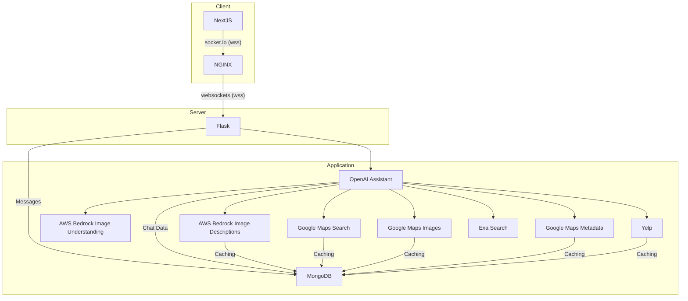
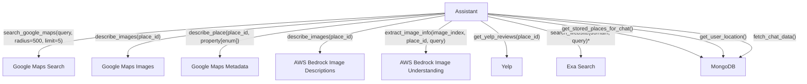

# Why this Project?

Doordash feels are high, and the UI is un-intuitive to me. I also recently wrote an [order assistant](https://github.com/sachiniyer/order-assistant) so I thought it would be interesting to write the other half of the food ordering workflow.

I also wanted to work on live data instead a dataset because:
1. I have already messed around with big datasets (e.g. [Wikipedia Editor Analysis Project](https://github.com/sachiniyer/wikipedia-editor-analysis))
2. I didn't want to pay for a bunch of storage, pre-processing.
3. I really wanted to not have to search "food" into google maps again

# Overall Architecture
At a high level, I have the following components:
1. NextJS with tailwindcss for the frontend (with vercel for deployment)
2. NGINX for the reverse proxy
3. Flask for the backend (with docker-compose for deployment)
3. MongoDB for the database
4. OpenAI assistant API for the agent
5. Many APIs
  - AWS Bedrock for image detection through claude models (dogfooding my service)
  - Google Maps for location data
  - Yelp for Review data
  - Exa Search for restaurant website data
  
## System Diagram

The system caches data from each of the APIs to be retrieved again. Additionally, there is semi-intelligent linking between each of these APIs so that the assistant does not have to remember everything. 

## Assistant Diagram

Tool call definitions are in [constants.py](backend/utils/constants.py), and the assistant definition is in [assistant.py](backend/services/assistant.py)
    

*For `search_website`: I was prefilling the domain originally, but in an edge case, the assistant prefilled the domain from a yelp review for me. I think performance may actually be better if I let the assistant choose the domain

# Q/A

**Q:** Why an assistant instead of a traditional RAG layer before any LLM interaction?

**A:** I tried just doing the search manually and then giving those results to the LLM, but I found there to be a worse performance. Additionally, I realized that there is a lot more flexibility if I let the assistant make the searches itself. I have seen results where the assistant did not like the results it returned and then tweaked the query. Additionally, letting the assistant configure the search parameters allows it to search for exactly the amount of results it needs. Overall, I think this architecture can scale to more use cases/edge cases than a traditional RAG layer.

**Q:** Why not add an API for menu data?

**A:** It is really hard to find a good one. The best one that I found was https://www.mealme.ai/ however it costed quite a bit. I would like to integrate with something else in the future, but for now the google images and the website data provide menu information (and often can do an okay job).
> Hi Sachin. Thanks for the note. Our cheapest plan is $10k per year paid in advance and would take a few business days to complete implementation at the earliest.

**Q:** Why not embed the google images?

**A:** I had links for the google images ready to go, however you need the API key as a query parameter ([source](https://developers.google.com/maps/documentation/places/web-service/photos)). I did not feel safe bringing up my API key into the UI and I did not have time to transfer the images to someplace else and then bring them up. Currently, you can actually display images but I have not let the assistant see image URLs with my API key in them.

**Q:** Where is the backend deployed?

**A:** https://mealsapi.sachiniyer.com (on a random AWS EC2 instance)

**Q** What was the hardest part of this project?

**A** The hardest part of the project tbh was catching all the edge cases. There were quite a few APIs that I was integrating with, so I had to make sure that all the tool calls/APIs were configured properly and functioning correctly.
